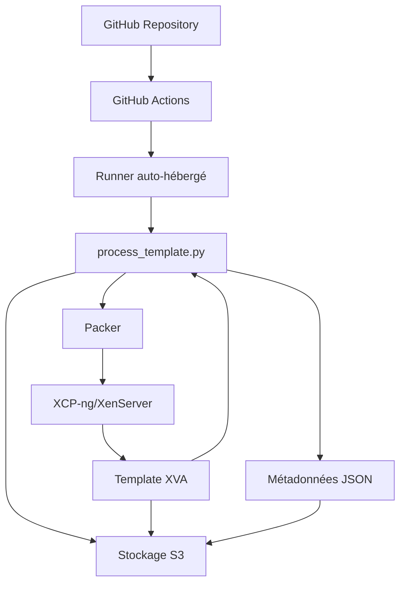
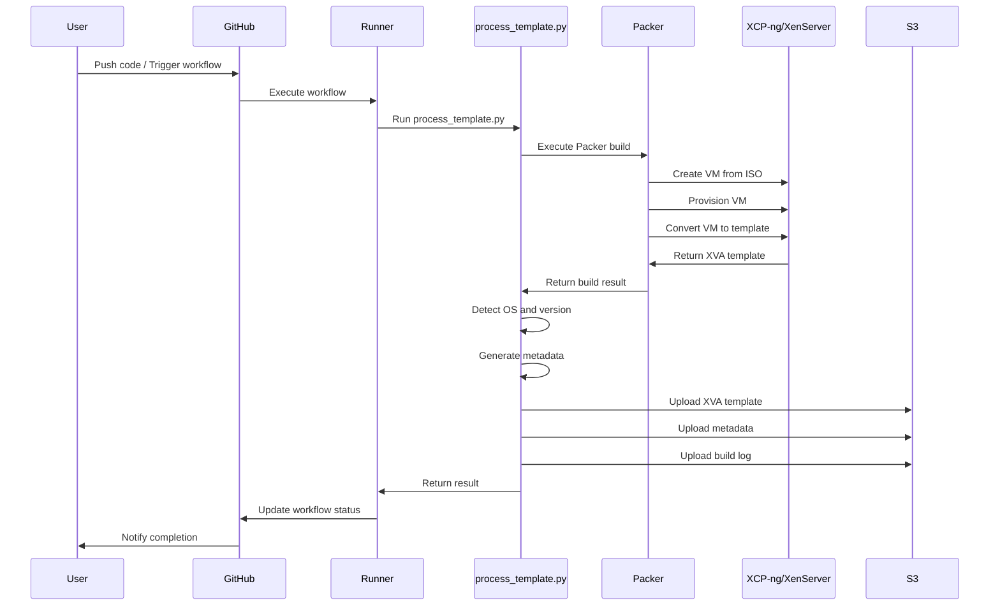
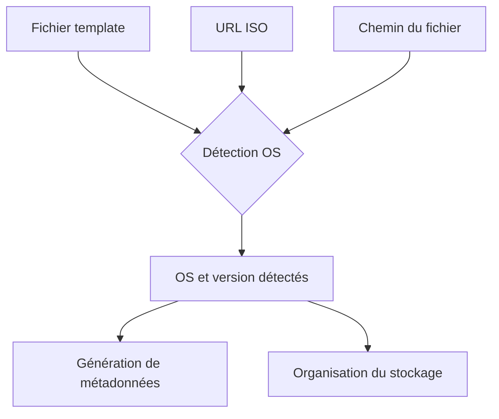
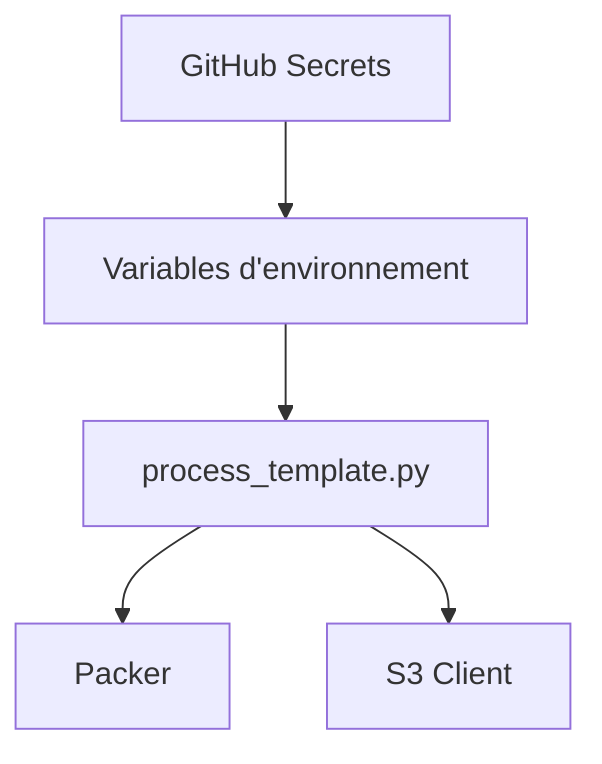
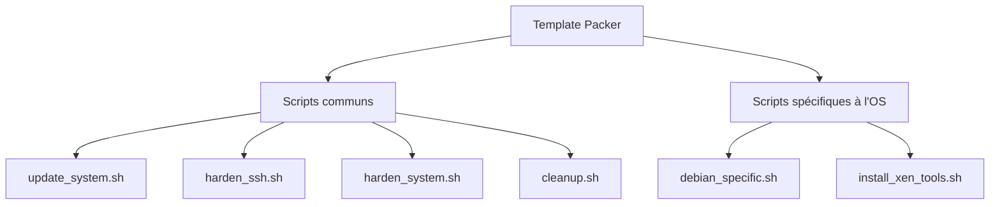

# System Patterns

Ce document décrit l'architecture du système, les flux de travail, et les patterns de conception utilisés dans le projet d'automatisation de templates Packer.

## Architecture du système

L'architecture du système est basée sur plusieurs composants qui interagissent pour automatiser la création et le déploiement de templates de machines virtuelles.



### Composants principaux

1. **GitHub Repository**: Stocke le code source, les templates Packer, et les scripts de provisionnement
2. **GitHub Actions**: Orchestre le processus d'automatisation via des workflows
3. **Runner auto-hébergé**: Exécute les workflows GitHub Actions
4. **process_template.py**: Script principal qui coordonne le processus
5. **Packer**: Outil de création d'images de machines virtuelles
6. **XCP-ng/XenServer**: Plateforme de virtualisation cible
7. **Template XVA**: Image de machine virtuelle générée
8. **Métadonnées JSON**: Informations sur le template généré
9. **Stockage S3**: Stockage des templates et des métadonnées

## Flux de travail

Le flux de travail principal du système est le suivant:



## Patterns de conception

### 1. Pattern de détection automatique

Le système utilise un pattern de détection automatique pour identifier le système d'exploitation et sa version à partir de différentes sources d'information:



**Implémentation**: La fonction `determine_os_info` dans `process_template.py` utilise plusieurs méthodes de détection et retourne le résultat le plus fiable.

### 2. Pattern de téléchargement structuré

Le système organise les fichiers téléchargés selon un pattern hiérarchique basé sur le système d'exploitation, la version et l'horodatage:

```
templates/
└── {os_type}{os_version}/
    └── {timestamp}/
        ├── {os_type}{os_version}.xva
        ├── metadata.json
        └── build.log
```

**Implémentation**: Les fonctions de téléchargement dans `process_template.py` construisent les chemins de destination en fonction des informations détectées.

### 3. Pattern de configuration externalisée

Le système externalise les configurations sensibles via des secrets GitHub et des variables d'environnement:



**Implémentation**: Le workflow GitHub Actions définit les variables d'environnement à partir des secrets, et le script les utilise pour configurer Packer et le client S3.

### 4. Pattern de provisionnement modulaire

Le système utilise un pattern de provisionnement modulaire avec des scripts réutilisables:



**Implémentation**: Les templates Packer référencent des scripts de provisionnement modulaires qui peuvent être réutilisés et combinés selon les besoins.

## Interactions entre composants

### Interaction GitHub Actions - Runner

GitHub Actions communique avec le runner auto-hébergé pour exécuter les workflows. Le runner doit être configuré avec le label `self-hosted` et avoir accès au serveur XCP-ng et au stockage S3.

### Interaction process_template.py - Packer

Le script `process_template.py` exécute Packer en ligne de commande et capture sa sortie pour analyse. Il utilise les informations de sortie pour déterminer le chemin du fichier XVA généré.

### Interaction Packer - XCP-ng

Packer communique avec XCP-ng via l'API XAPI pour créer et provisionner des machines virtuelles. Il nécessite des informations d'authentification pour accéder au serveur.

### Interaction process_template.py - S3

Le script `process_template.py` utilise la bibliothèque boto3 pour communiquer avec le stockage S3 et télécharger les fichiers générés. Il nécessite des informations d'authentification pour accéder au bucket S3.

## Considérations de conception

### Sécurité

- Les informations d'authentification sont stockées dans des secrets GitHub et ne sont jamais exposées dans le code
- Les clés d'accès S3 ont des permissions minimales nécessaires
- Les templates générés sont sécurisés selon les meilleures pratiques (SSH, firewall, etc.)

### Extensibilité

- L'architecture est conçue pour être facilement extensible à d'autres systèmes d'exploitation
- Les scripts de provisionnement sont modulaires et réutilisables
- Le système de détection automatique peut être étendu pour prendre en charge de nouvelles sources d'information

### Maintenabilité

- Le code est organisé de manière logique et documenté
- Les fonctionnalités sont séparées en modules distincts
- Les patterns de conception sont utilisés pour simplifier la compréhension et la maintenance
